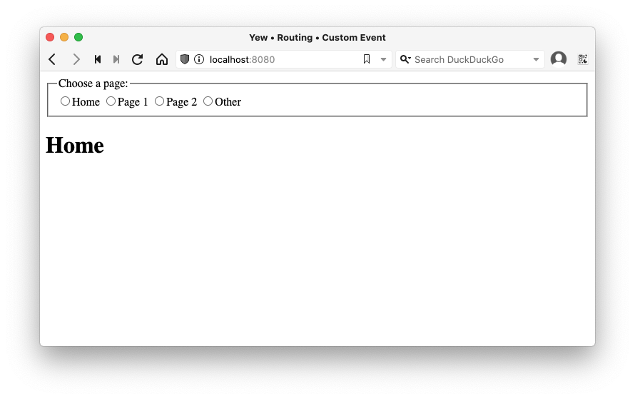

# change_yew_route_from_js
Example of changing Yew route from javascript

Demonstration changing Yew route from a Javascript function using a [Custom Event](https://developer.mozilla.org/en-US/docs/Web/Events/Creating_and_triggering_events).

## Principle of operation

```
    ┌────────────────────┐ 
    | index.html radio   |
    |  button onclick    |
    |     │              | 
    │     ▼              | 
    | change_route(path) |                ┌───────────────────────┐
    |  dispatchEvent ───────────────────► | event listener set-up |
    └────────────────────┘     path       |  by Yew component     |
                                          |     │                 |
                                          │     ▼                 |
                                          | Yew updates route and │
                                          |  re-renders page      |
                                          └───────────────────────┘
```

## Prerequisites

* [Yew](https://yew.rs/docs/tutorial#prerequisites) 0.20

## To run

```
% git clone https://github.com/jq170727/change_yew_route_from_js
% cd change_yew_route_from_js
% trunk serve
```

<details>
  <summary>
  Sample run
  </summary>
  <pre>
% git clone https://github.com/jq170727/change_yew_route_from_js
  Cloning into 'change_yew_route_from_js'...
  remote: Enumerating objects: 4, done.        
  remote: Counting objects: 100% (4/4), done.        
  remote: Compressing objects: 100% (4/4), done.        
  remote: Total 4 (delta 0), reused 0 (delta 0), pack-reused 0        
  Receiving objects: 100% (4/4), done.
% cd change_yew_route_from_js
% trunk serve
  2023-01-27T00:56:14.138612Z  INFO 📦 starting build
  2023-01-27T00:56:14.138951Z  INFO spawning asset pipelines
  2023-01-27T00:56:20.327100Z  INFO building change-yew-route-from-js
     Compiling proc-macro2 v1.0.50
     Compiling unicode-ident v1.0.6
     Compiling quote v1.0.23
     Compiling syn v1.0.107
     Compiling serde_derive v1.0.152
     Compiling log v0.4.17
     Compiling serde v1.0.152
     Compiling wasm-bindgen-shared v0.2.83
     Compiling cfg-if v1.0.0
     Compiling once_cell v1.17.0
     Compiling bumpalo v3.12.0
     Compiling serde_json v1.0.91
     Compiling itoa v1.0.5
     Compiling ryu v1.0.12
     Compiling wasm-bindgen v0.2.83
     Compiling autocfg v1.1.0
     Compiling futures-core v0.3.25
     Compiling futures-channel v0.3.25
     Compiling futures-sink v0.3.25
     Compiling thiserror v1.0.38
     Compiling version_check v0.9.4
     Compiling memchr v2.5.0
     Compiling futures-task v0.3.25
     Compiling slab v0.4.7
     Compiling percent-encoding v2.2.0
     Compiling pin-project-lite v0.2.9
     Compiling futures-util v0.3.25
     Compiling proc-macro-error-attr v1.0.4
     Compiling form_urlencoded v1.1.0
     Compiling pin-utils v0.1.0
     Compiling futures-io v0.3.25
     Compiling rustversion v1.0.11
     Compiling proc-macro-error v1.0.4
     Compiling indexmap v1.9.2
     Compiling anymap2 v0.13.0
     Compiling prettyplease v0.1.23
     Compiling hashbrown v0.12.3
     Compiling boolinator v2.4.0
     Compiling route-recognizer v0.3.1
     Compiling tracing-core v0.1.30
     Compiling implicit-clone v0.3.5
     Compiling wasm-bindgen-backend v0.2.83
     Compiling wasm-bindgen-macro-support v0.2.83
     Compiling thiserror-impl v1.0.38
     Compiling futures-macro v0.3.25
     Compiling pin-project-internal v1.0.12
     Compiling tracing-attributes v0.1.23
     Compiling yew-macro v0.20.0
     Compiling yew-router-macro v0.17.0
     Compiling wasm-bindgen-macro v0.2.83
     Compiling pin-project v1.0.12
     Compiling tracing v0.1.37
     Compiling futures v0.3.25
     Compiling pinned v0.1.0
     Compiling serde_urlencoded v0.7.1
     Compiling bincode v1.3.3
     Compiling js-sys v0.3.60
     Compiling console_error_panic_hook v0.1.7
     Compiling web-sys v0.3.60
     Compiling wasm-bindgen-futures v0.4.33
     Compiling serde-wasm-bindgen v0.4.5
     Compiling gloo-timers v0.2.6
     Compiling gloo-utils v0.1.6
     Compiling gloo-events v0.1.2
     Compiling gloo-dialogs v0.1.1
     Compiling gloo-render v0.1.1
     Compiling custom-elements v0.2.0
     Compiling gloo-console v0.2.3
     Compiling gloo-file v0.2.3
     Compiling gloo-history v0.1.3
     Compiling gloo-storage v0.2.2
     Compiling gloo-net v0.2.6
     Compiling gloo-worker v0.2.1
     Compiling gloo v0.8.0
     Compiling prokio v0.1.0
     Compiling yew v0.20.0
     Compiling yew-router v0.17.0
     Compiling change-yew-route-from-js v0.1.0 (/tmp/change_yew_route_from_js)
      Finished dev [unoptimized + debuginfo] target(s) in 43.17s
  2023-01-27T00:57:03.807630Z  INFO fetching cargo artifacts
  2023-01-27T00:57:04.310945Z  INFO processing WASM for change-yew-route-from-js
  2023-01-27T00:57:04.357216Z  INFO using system installed binary app=wasm-bindgen version=0.2.83
  2023-01-27T00:57:04.357460Z  INFO calling wasm-bindgen for change-yew-route-from-js
  2023-01-27T00:57:04.618701Z  INFO copying generated wasm-bindgen artifacts
  2023-01-27T00:57:04.620945Z  INFO applying new distribution
  2023-01-27T00:57:04.621590Z  INFO ✅ success
  2023-01-27T00:57:04.622424Z  INFO 📡 serving static assets at -> /
  2023-01-27T00:57:04.622557Z  INFO 📡 server listening at http://127.0.0.1:8080
  2023-01-27T00:57:04.622780Z  INFO 📦 starting build
  2023-01-27T00:57:04.622937Z  INFO spawning asset pipelines
  2023-01-27T00:57:05.026886Z  INFO building change-yew-route-from-js
      Finished dev [unoptimized + debuginfo] target(s) in 0.10s
  2023-01-27T00:57:05.435105Z  INFO fetching cargo artifacts
  2023-01-27T00:57:05.842844Z  INFO processing WASM for change-yew-route-from-js
  2023-01-27T00:57:05.869473Z  INFO using system installed binary app=wasm-bindgen version=0.2.83
  2023-01-27T00:57:05.869562Z  INFO calling wasm-bindgen for change-yew-route-from-js
  2023-01-27T00:57:06.125666Z  INFO copying generated wasm-bindgen artifacts
  2023-01-27T00:57:06.127488Z  INFO applying new distribution
  2023-01-27T00:57:06.128590Z  INFO ✅ success
  ^C
% 
  </pre>
</details>

Open http://localhost:8080 in your browser if necessary.  You should see a page



Clicking on the radio buttons will change the route rendered by Yew.


## References
* Stack Overflow: [How to control Yew route from external JS in SPA?](https://stackoverflow.com/questions/75203156/how-to-control-yew-route-from-external-js-in-spa)
* Reddit: [r/rust Hey Rustaceans! Got a question? Ask here!](https://www.reddit.com/r/rust/comments/10j6k7v/hey_rustaceans_got_a_question_ask_here_42023/j5qacis/)
* Yew Discussion: (https://github.com/yewstack/yew/discussions/3095)
  
